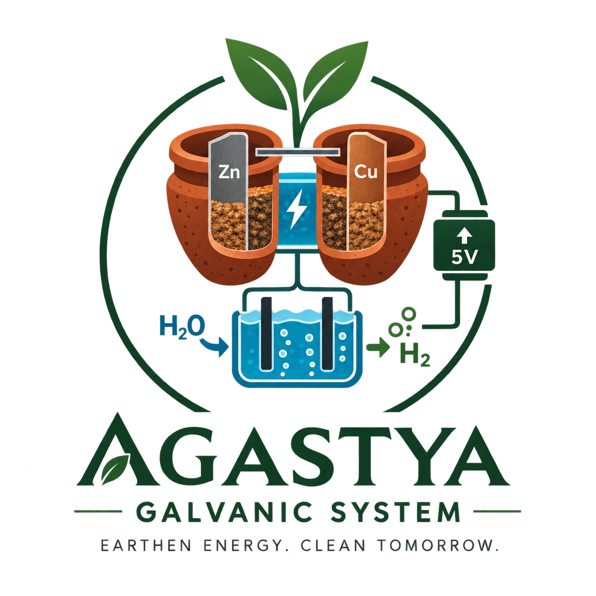

# The Agastya Galvanic System

> **A Biodegradable, Non-Lithium Earthen Solid-State Primary Battery with Sub-Volt Energy Harvesting for Disposable Off-Grid Micro-Sensors**

*Academic Year 2026*

---

## Overview

A two-cell **terracotta + sawdust earthen galvanic stack** (Zn / 1.0 M CuSO₄-in-sawdust / Cu) drives an **ultra-low-input synchronous boost converter** that cold-starts below 0.9 V and outputs a regulated **5.0 V ± 2 % rail at ≥ 82 % efficiency**. That rail powers a **graphite-electrode micro-electrolyzer** that splits water into visible hydrogen — all with **zero secondary batteries** and **0 % lithium**.

## Key Specifications & Target Metrics

| Metric | Target | Status |
|---|---|---|
| Stack open-circuit voltage (2-cell) | ≥ 2.10 V | Pending verification (Phase 1) |
| Short-circuit current @ 25 °C | ≥ 20 mA | Pending verification (Phase 1) |
| Regulated rail | 5.0 V ± 2 % | Pending verification (Phase 2) |
| End-to-end efficiency | ≥ 82 % | Pending verification (Phase 2) |
| Continuous discharge | ≥ 4 h @ 15 mA | Pending verification (Phase 4) |
| Cathodic bubbling time | ≤ 10 s | Pending verification (Phase 3) |
| Secondary battery assistance | 0 | By design |

## Quick Start

1. **Procurement & Build:** [`docs/FULL_SCALE_BOM.md`](docs/FULL_SCALE_BOM.md) — full-scale display model BOM & engineering improvements.
2. **Lab Safety:** [`docs/SAFETY.md`](docs/SAFETY.md) — read before handling chemical reagents.
3. **Engineering Roadmap:** [`ROADMAP.md`](ROADMAP.md) — academic milestones, gates & risk register.
4. **Technical Wiki:** [`wiki.md`](wiki.md) — comprehensive mathematical models & EEE theory.

## Documentation Index

| File | What it contains |
|---|---|
| [`ROADMAP.md`](ROADMAP.md) | Milestones, workback schedule, risk register, success gate checklist |
| [`wiki.md`](wiki.md) | Live project index, system overview, directory map |
| [`docs/FULL_SCALE_BOM.md`](docs/FULL_SCALE_BOM.md) | Full-scale prototype BOM with component specs, sourcing & improvements |
| [`docs/BOM.md`](docs/BOM.md) | Benchtop PoC bill of materials |
| [`docs/PRD.md`](docs/PRD.md) | Formal requirements & verification matrix |
| [`docs/ARCHITECTURE.md`](docs/ARCHITECTURE.md) | System block diagram & interfaces |
| [`docs/SAFETY.md`](docs/SAFETY.md) | Hazard assessment, PPE, waste & emergency procedures |
| [`docs/ELECTROCHEM.md`](docs/ELECTROCHEM.md) | Nernst, polarisation, R_int, energy budget, configuration benchmarks |
| [`docs/HISTORICAL_ANALYSIS.md`](docs/HISTORICAL_ANALYSIS.md) | Ancient Sanskrit text, word-by-word translation, evidence vs interpretation |
| [`docs/PMIC.md`](docs/PMIC.md) | Boost converter design, IC selection, efficiency budget |
| [`docs/ELECTROLYZER.md`](docs/ELECTROLYZER.md) | Electrolyzer design, gas metrology, η_F protocol |
| [`docs/SYLLABUS_MAPPING.md`](docs/SYLLABUS_MAPPING.md) | EEE domain mapping ("New POV") |
| [`docs/REPORT.md`](docs/REPORT.md) | Thesis/report skeleton |
| [`docs/PRESENTATION.md`](docs/PRESENTATION.md) | Slides outline + viva Q&A bank |

## Project Status
Current Phase: Phase 0/7 (Foundations & Documentation)

- Initial specifications and safety analysis completed
- Phase 1: Cell chemistry bench testing underway

---

*Measurement logs and test curves will be recorded under `data/` as phases progress.*